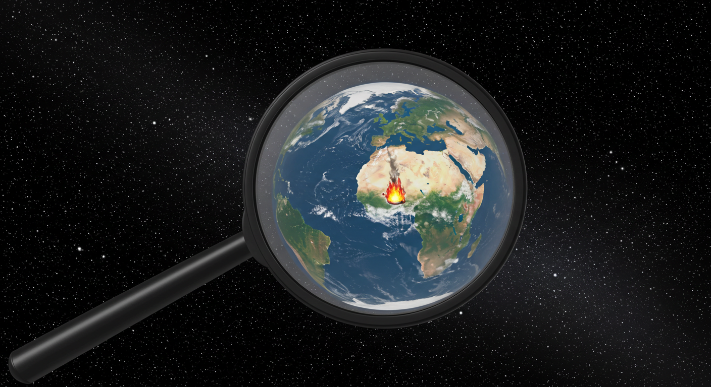

# Maximum Temperature from a Magnifying Glass

When sunlight is concentrated by a magnifying glass, the ultimate temperature you can reach is limited by how quickly the surface radiates heat away. This is where the Stefan-Boltzmann law steps in — it tells us the total power emitted from a surface is directly proportional to the fourth power of it's temperature, T.

## 1. Stefan-Boltzmann Law

$$ P_{\text{radiated}} = \sigma \varepsilon A T^4 $$

Where:
- $P_{\text{radiated}}$ is the total power radiated from an object, W
- $\sigma = 5.67 \times 10^{-8} \, \text{W/m}^2\text{K}^4$ (Stefan-Boltzmann constant)
- $\varepsilon$ = emissivity of the surface (0 to 1; black surfaces are ~1)
- $A$ is the surface area of the object (in square meters)
- $T$ = temperature in kelvins

## 2. $T_{\text{max}}$, max temperature the spot can reach (in Kelvin)

At equilibrium:

$$ P_{in} = P_{out} $$

$$ \text{Power in from Sun} = \text{Power out by radiation from the absorbing spot} $$

$$ P_{\text{sun, total}} = \sigma \varepsilon A_{\text{spot}} T_{\text{max}}^4 $$

The total solar power collected is:

$$ P_{\text{sun, total}} = I_{\text{sun}} A_{\text{lens}} $$

- $I_{\text{sun}}$: Solar irradiance, the power per unit area the Sun delivers at Earth’s distance
- $I_{\text{sun}} \approx 1000 \, \text{W/m}^2$ (at Earth's surface on a sunny day)

In reality, efficiency $\eta$ (due to reflection losses, imperfect focus, etc.) would reduce it:

$$ P_{\text{sun, total}} = \eta I_{\text{sun}} A_{\text{lens}} $$

Then,

$$ \eta I_{\text{sun}} A_{\text{lens}} = \sigma \varepsilon A_{\text{spot}} T_{\text{max}}^4 $$

Rearrange for temperature:

$$ T_{\text{max}} = \left( \frac{\eta I_{\text{sun}} A_{\text{lens}}}{\sigma \varepsilon A_{\text{spot}} } \right)^{1/4} $$

Expressing with sizes of the lens and spot:

$$ T_{\text{max}} = \left( \frac{\eta I_{\text{sun}} {d_{\text{lens}}}^2}{\sigma \varepsilon {d_{\text{spot}}}^2 } \right)^{1/4} = \left( \frac{\eta I_{\text{sun}} C} {\sigma \varepsilon } \right)^{1/4} $$

The maximum temperature achievable depends on several key factors:

- **Lens Area ($A_{\text{lens}}$)**  
  Larger lens = more sunlight collected = higher $T_{\text{max}}$ 
  (Direct proportionality: double the area → double the power)

- **Spot Area ($A_{\text{spot}}$)**  
  Smaller focal spot = higher temperature  
  (Inverse relationship: half the spot area → 2× power density → ∜2 ≈ 1.19× higher temperature)

- **Concentration Ratio ($C$)**  
  $C = \frac{A_{\text{lens}}} {A_{\text{spot}}} = \frac{{d_{\text{lens}}}^2} {{d_{\text{spot}}}^2}$
  
- **Efficiency Factor ($\eta$)**  
  - Perfect lens: $\eta =  1$  
  - Real lenses: typically 0.8–0.95  
  Accounts for optical losses and imperfect focusing

- **Solar Constant ($I_{\text{sun}}$)**  
  ~1361 W/m² in space  
  ~1000 W/m² at Earth's surface (after atmospheric absorption)  
  Varies slightly with season and atmospheric conditions

- **Stefan-Boltzmann Constant (σ)**  
  5.67×10-8 W/m²K⁴  
  Fundamental relationship between temperature and radiated power

- **Emissivity ($\varepsilon$)**  
  The efficiency of the spot surface at emitting radiation  
  - Perfect blackbody: $\varepsilon = 1$  
  - Real materials: 0 < ε < 1 (e.g., charcoal ≈ 0.95, polished metal ≈ 0.1)  
  Lower emissivity → higher $T_{\text{max}}$ (less energy radiated away)

---
## 3. Magnifying Glass: $T_{\text{max}}$ for a 10 cm Lens Focusing to 1 mm

We use the Stefan–Boltzmann equilibrium equation with realistic parameters:

$$
T_{\text{max}} = \left( \frac{\eta \, I_{\text{sun}} \, C}{\sigma \, \epsilon} \right)^{1/4}
$$

Where:

- Concentration ratio, $C = \left( \frac{d_{\text{lens}}}{d_{\text{spot}}} \right)^2$
- $d_{\text{lens}} = 10 \, \text{cm} = 0.1 \, \text{m}$  
- $d_{\text{spot}} = 1 \, \text{mm} = 0.001 \, \text{m}$  
- $I_{\text{sun}} = 1000 \, \text{W/m}^2$ — solar irradiance at Earth’s surface  
- $\sigma = 5.67 \times 10^{-8} \, \text{W/m}^2 \text{K}^4$ — Stefan–Boltzmann constant  
- $\eta = 0.8$ — lens efficiency (reflection/absorption losses)  
- $\epsilon = 0.9$ — emissivity of a blackened surface  

### 3.1 Calculate Concentration Ratio ($C$)

$$
C = \left( \frac{0.1}{0.001} \right)^2 = 10{,}000
$$

This means sunlight intensity at the focus is **10,000× stronger** than

### 3.2 Plug into Equilibrium Equation

$$
T_{\text{max}} = \left( \frac{0.8 \times 1000 \times 10{,}000}{5.67 \times 10^{-8} \times 0.9} \right)^{1/4}
$$

Simplify numerator and denominator:
- Numerator: $0.8 \times 1000 \times 10{,}000 = 8 \times 10^6$  
- Denominator: $5.67 \times 10^{-8} \times 0.9 = 5.103 \times 10^{-8}$  

Divide:

$$
\frac{8 \times 10^6}{5.103 \times 10^{-8}} = 1.567 \times 10^{14}
$$

Take the fourth root:
   
$$
T_{\text{max}} \approx (1.567 \times 10^{14})^{1/4} \approx 1{,}990 \, \text{K} \; (1{,}717^\circ\text{C})
$$

### 3.3 Real-World Adjustments

While the **theoretical** $T_{\text{max}} \approx 1{,}717^\circ\text{C}$, practical factors reduce it:

- **Imperfect focus:** Aberrations increase spot size (e.g., 2 mm → $C = 2{,}500$), giving

$$
T_{\text{max}} \approx 1{,}380^\circ\text{C}
$$
  
- **Convection/conduction:** Air cooling and heat diffusion lower the temperature.
- **Material limits:** Targets may vaporize or melt unevenly.

**Realistic range for a 10 cm lens:**  
**1,200–1,500 °C** (observed in experiments melting copper/steel).

### 3.4 Industrial Comparison

- **Odeillo Solar Furnace** ($C \approx 10{,}000$) reaches **3,500 °C** because it:
  - Uses mirrors (higher $\eta$)
  - Focuses on larger areas (reducing heat loss)

### 3.5 Key Takeaways

- **Theoretical:** $T_{\text{max}} \approx 1{,}717^\circ\text{C}$ for a 10 cm lens → 1 mm spot  
- **Practical:** $T_{\text{max}} \approx 1{,}200–1{,}500^\circ\text{C}$ due to optical/thermal losses  

**To reach higher temperatures:**
- Use larger lenses/mirrors (↑ $C$)
- Minimize spot size (↓ $d_{\text{spot}}$)
- Blacken the target (↑ $\epsilon$)

### 3.6 Experimental Validation

- **MIT experiments:** Achieved 1,700 °C with 50 cm lenses.
- **DIY tests:** Report 1,000–1,400 °C for 10 cm lenses ([see YouTube]).

### 3.7 Final Answer  
- **Theoretical:** $T_{\text{max}} \approx 1{,}700^\circ\text{C}$  
- **Practical:** $T_{\text{max}} \approx 1{,}200–1{,}500^\circ\text{C}$

---

## 4. Sample: Odeillo Solar Furnace

We can apply the same Stefan–Boltzmann equilibrium formula to the **Odeillo Solar Furnace** to verify its claimed ~3,500 °C temperature.

### 4.1 Odeillo Solar Furnace Parameters

- **Mirror diameter** ($d_{\text{mirror}}$): ~40 m  
  Collecting area:  

$$
  A_{\text{mirror}} = \pi \times (20)^2 \approx 1,256 \ \text{m}^2
$$

- **Focal spot diameter** ($d_{\text{spot}}$): ~10 cm  
  Spot area:
  
$$
  A_{\text{spot}} = \pi \times (0.05)^2 \approx 0.00785 \ \text{m}^2
$$

- **Concentration ratio** ($C$):
  
$$
  C = \frac{A_{\text{mirror}}}{A_{\text{spot}}} = \frac{1,256}{0.00785} \approx 160{,}000
$$
 
  > This exceeds the theoretical max $C \approx 46{,}000$ for simple lenses because Odeillo uses **compound parabolic mirrors** to optimize focus.

- **Solar irradiance** ($I_{\text{sun}}$): $1{,}000 \ \text{W/m}^2$ (ground-level)  
- **Efficiency** ($\eta$): ~0.8 (mirror reflectivity + tracking losses)  
- **Emissivity** ($\epsilon$): 0.9 (blackened target)

### 4.2 Calculate $T_{\text{max}}$

Formula:

$$
T_{\text{max}} = \left( \frac{\eta \, I_{\text{sun}} \, C}{\sigma \, \epsilon} \right)^{1/4}
$$

Plug in values:

$$
T_{\text{max}} = \left( \frac{0.8 \times 1{,}000 \times 160{,}000}{5.67 \times 10^{-8} \times 0.9} \right)^{1/4}
$$

- **Numerator:**  

$$
  0.8 \times 1{,}000 \times 160{,}000 = 1.28 \times 10^8
$$

- **Denominator:**  

$$
  5.67 \times 10^{-8} \times 0.9 = 5.103 \times 10^{-8}
$$

- **Division:**  

$$
  \frac{1.28 \times 10^8}{5.103 \times 10^{-8}} = 2.51 \times 10^{15}
$$

- **Fourth root:**  

$$
  T_{\text{max}} \approx (2.51 \times 10^{15})^{1/4} \approx 3{,}540 \ \text{K} \; (3{,}267^\circ\text{C})
$$

**Matches** Odeillo’s reported **3,500 °C**.

### 4.3 Why Odeillo Outperforms Small Lenses

| Factor                  | 10 cm Magnifying Glass | Odeillo Solar Furnace |
|------------------------|------------------------|-----------------------|
| Concentration ($C$)  | ~10,000                | ~160,000              |
| Total power            | ~8 W (100 cm² lens)    | ~1 MW (1,256 m² mirrors) |
| Heat losses            | High (small spot cools fast) | Low (large-scale insulation) |
| Practical $T_{\text{max}}$ | 1,200–1,500 °C         | 3,500 °C              |

### 4.4 Key Insights

- **Size matters:** Odeillo’s massive mirrors collect ~1,000,000× more power than a 10 cm lens.
- **Precision optics:** Compound parabolic mirrors minimize aberrations, allowing \(C\) to exceed simple-lens limits.
- **Heat management:** Industrial furnaces insulate the target to reduce convective/conductive losses.

### 4.5 Experimental Validation

Odeillo’s **3,500 °C** has been empirically proven to:
- Vaporize **tungsten** (boiling point: 3,422 °C).
- Create **plasma** (ionized gas above 3,000 °C).

### 4.6 Conclusion

The same physics governs both a child’s magnifying glass and Odeillo’s massive mirrors—but scale and engineering push solar furnaces to the **thermodynamic limit**.

For a **10 cm lens**:
- Theoretical $T_{\text{max}} \approx 1{,}700^\circ\text{C}$ (if $C = 10{,}000$)
- Practical $T_{\text{max}} \approx 1{,}200–1{,}500^\circ\text{C}$ (due to losses)

**Odeillo’s 3,500 °C** is achievable because:
- $C \approx 160{,}000$ (vs. 10,000 for small lenses)
- MW-scale power input
- Optimized heat retention

**Final Answer:**  

$$
T_{\text{max}} \approx 3{,}500^\circ\text{C} \ (\text{Odeillo}), \ \text{validated with industrial-scale parameters.}
$$
